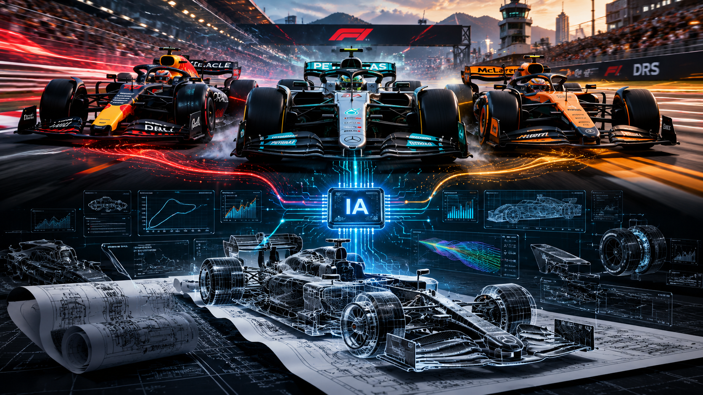

# IA e Engenharia na Fórmula 1

  

Projeto acadêmico desenvolvido com o objetivo de estudar como a Inteligência Artificial, a análise de dados e as técnicas de engenharia são aplicadas atualmente na Fórmula 1.

---

## 📌 Sobre o projeto

A Fórmula 1 é uma das categorias automobilísticas que mais utilizam tecnologia, engenharia e análise de dados para melhorar o desempenho dos carros e das equipes.

Neste projeto, foi investigada a utilização da Inteligência Artificial em diferentes áreas da Fórmula 1, relacionando seus recursos com a engenharia mecânica, a análise de dados, a simulação computacional e as estratégias utilizadas durante as corridas.

O projeto foi desenvolvido com o auxílio de ferramentas de Inteligência Artificial, principalmente o Gemini Notebook (NotebookLM), utilizado para organizar as fontes, analisar informações e gerar materiais de estudo a partir do conteúdo pesquisado.

---

## ❓ Pergunta central

**Como a Inteligência Artificial é utilizada atualmente na Fórmula 1?**

---

## 🎯 Objetivos

### Objetivo geral

Compreender como a Inteligência Artificial e as tecnologias relacionadas à análise de dados são utilizadas na Fórmula 1 e como elas contribuem para a engenharia e o desempenho das equipes.

### Objetivos específicos

- Compreender a evolução tecnológica da Fórmula 1;
- Identificar aplicações da Inteligência Artificial na categoria;
- Analisar a importância da telemetria e dos dados;
- Compreender a relação entre IA e engenharia automotiva;
- Conhecer aplicações de simulação computacional e CFD;
- Entender o conceito de gêmeos digitais;
- Analisar o uso de algoritmos de otimização;
- Compreender a utilização de dados nas estratégias de corrida;
- Identificar benefícios e limitações do uso da Inteligência Artificial na Fórmula 1.

---

## 🏎️ Principais temas abordados

Durante o desenvolvimento do projeto foram estudados os seguintes temas:

- Inteligência Artificial na Fórmula 1;
- Machine Learning;
- Análise de dados;
- Telemetria;
- Engenharia automotiva;
- Aerodinâmica;
- Simulação computacional;
- CFD (Dinâmica dos Fluidos Computacional);
- Gêmeos digitais;
- Algoritmos de otimização;
- Estratégias de corrida;
- Desenvolvimento e evolução dos carros;
- Relação entre engenheiros e Inteligência Artificial.

---

## 🧠 Utilização do Gemini Notebook (NotebookLM)

O Gemini Notebook (NotebookLM) foi utilizado como ferramenta de apoio à pesquisa e organização do conhecimento.

As fontes selecionadas foram adicionadas ao notebook para que a ferramenta pudesse analisar o conteúdo e responder perguntas relacionadas ao tema do projeto.

A partir dessas fontes foram desenvolvidos materiais de apoio, incluindo:

- Relatório;
- Mapa mental;
- Infográfico;
- Slides;
- Flashcards;
- Quiz;
- Resumos;
- Conteúdos em áudio e outros materiais de estudo.

O uso da ferramenta teve como objetivo organizar as informações e facilitar a análise do tema, mantendo as respostas relacionadas às fontes utilizadas no projeto.

---

## 🔎 Perguntas realizadas e aprendizados

Durante a pesquisa foram realizadas perguntas relacionadas às principais aplicações da Inteligência Artificial e da engenharia na Fórmula 1.

### Perguntas realizadas

- Como a Inteligência Artificial é utilizada atualmente na Fórmula 1?
- Como a IA auxilia na análise de dados e telemetria?
- Como a Inteligência Artificial contribui para o desenvolvimento dos carros?
- Como a simulação computacional e a CFD são utilizadas na Fórmula 1?
- Como algoritmos de otimização podem ser utilizados no desenvolvimento de carros e estratégias?
- Quais são os benefícios e limitações do uso da Inteligência Artificial na Fórmula 1?

### Principais conhecimentos obtidos

- A importância da coleta e análise de grandes volumes de dados;
- A utilização da telemetria para acompanhar o comportamento do carro;
- A aplicação de Inteligência Artificial e Machine Learning na análise de dados;
- A utilização de simulações computacionais no desenvolvimento dos carros;
- A importância da CFD no estudo aerodinâmico;
- A utilização de algoritmos de otimização no desenvolvimento de componentes;
- A aplicação de dados e modelos computacionais na definição de estratégias de corrida;
- A importância da atuação dos engenheiros mesmo com o avanço da Inteligência Artificial;
- As limitações relacionadas à qualidade dos dados, custo computacional e regulamentações da categoria.
---

## 🖼️ Evidências das respostas do Gemini Notebook

Durante a pesquisa, foram realizadas perguntas ao Gemini Notebook com base nas fontes selecionadas para o projeto. As imagens abaixo apresentam exemplos das respostas geradas, incluindo as citações das fontes utilizadas pelo notebook para fundamentar as informações apresentadas.

### Evidências

- [Pergunta 1 — IA na Fórmula 1](./pergunta-01-ia-na-f1.png)
- [Pergunta 2 — Dados e telemetria](./pergunta-02-dados-e-telemetria.png)
- [Pergunta 3 — Engenharia e evolução tecnológica](./pergunta-03-engenharia-evolucao.png)
- [Pergunta 4 — Otimização e simulação](./pergunta-04-otimizacao.png)

As evidências demonstram como o Gemini Notebook utilizou as fontes selecionadas para responder às perguntas e apresentar as respectivas citações ao longo das respostas.

## 📚 Fontes utilizadas

As fontes foram selecionadas buscando reunir materiais acadêmicos, técnicos e conteúdos relacionados à engenharia, tecnologia e automobilismo.

Entre as fontes utilizadas estão:

- **Evolutionary Design Optimization For a Formula One Car and Track** — Daniel Harper;
- **How Artificial Intelligence, Machine Learning, and Robotics Enhance Performance Prediction...** — Rachel J. C. Fu e Michael B. Reid;
- **How Artificial Intelligence is transforming motorsport** — Universidad Politécnica de Madrid;
- **Inteligência artificial na F1: avanços em tecnologia e engenharia** — Race Week Blog;
- **Engenheiros que moldaram a Fórmula 1 – parte 3** — GPTotal;
- **Maiores evoluções da F1 | Tudo sobre Fórmula 1**;
- **Evolution of Formula 1 Engine...** — Aarav Gupta.

Além dessas fontes, foram utilizados materiais de apoio organizados dentro do Gemini Notebook para complementar a pesquisa.

A seleção das fontes buscou evitar o uso indiscriminado de informações, priorizando conteúdos relacionados diretamente ao tema estudado.

### Por que essas fontes foram utilizadas?

As fontes foram consideradas relevantes por apresentarem conteúdos acadêmicos, técnicos e institucionais relacionados diretamente à Fórmula 1, engenharia, Inteligência Artificial e análise de dados.

Sempre que possível, foram priorizados trabalhos acadêmicos, instituições de ensino e materiais técnicos especializados, buscando utilizar informações diretamente relacionadas ao tema do projeto.

---

## 📄 Relatório completo

O relatório foi desenvolvido dentro do Gemini Notebook e reúne em um único material o conteúdo, as análises e os elementos desenvolvidos durante o projeto.

👉 **[Visualizar o relatório completo no Gemini Notebook](https://notebooklm.link.google/T5SX24dRWC4s)**

---

## 🤖 Uso de Inteligência Artificial

A Inteligência Artificial foi utilizada como ferramenta de apoio durante o desenvolvimento do projeto.

O Gemini Notebook (NotebookLM) foi utilizado para:

- Organizar as fontes;
- Analisar os conteúdos pesquisados;
- Responder perguntas relacionadas ao tema;
- Identificar informações relevantes nas fontes;
- Organizar os conhecimentos obtidos;
- Auxiliar na produção dos materiais de estudo.

A ferramenta foi utilizada como apoio à pesquisa, enquanto a seleção das fontes, definição do tema, direcionamento das perguntas e organização do projeto foram realizados pelo autor.

---

## 🎓 Contexto acadêmico

Este projeto foi desenvolvido como atividade acadêmica relacionada à área de Engenharia Mecânica, utilizando a Fórmula 1 como contexto para estudar a aplicação de tecnologias modernas de Inteligência Artificial, análise de dados e engenharia.

O trabalho busca relacionar conceitos estudados na engenharia com aplicações tecnológicas presentes no automobilismo de alto desempenho.

---

## 👨‍🎓 Autor

**George André Cavalcanti**

Estudante de Engenharia Mecânica.

---

## 📌 Observação

Este repositório apresenta o desenvolvimento acadêmico do projeto e os principais conhecimentos obtidos durante a pesquisa.

O projeto também demonstra a utilização de ferramentas de Inteligência Artificial como apoio à pesquisa, organização e aprendizado.
